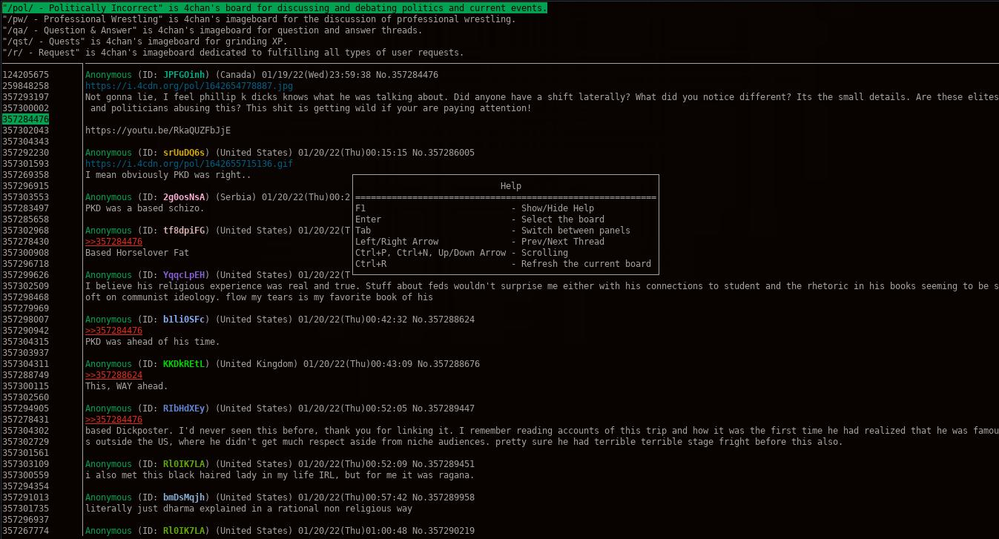

# Channel Four News


## Build
Channel Four News is written in Go and uses [go-cui](https://github.com/jroimartin/gocui) for the TUI interface.
```
[apu@helper]$ git clone https://github.com/channel-four-news/channel_four_news.git
[apu@helper]$ cd channel_four_news 
[apu@helper]$ make
[apu@helper]$ ./channel_four_news
```

## Enjoy
Channel Four News is in active development, but already functional. Contributions and Issue submissions are welcome. *Use discretion when browsing channel four.*


